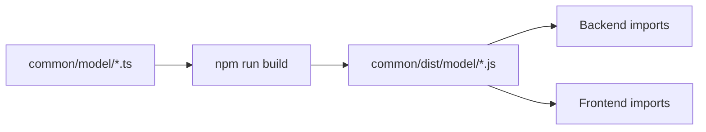

# Sketch Bridge 🎨

A real-time collaborative canvas application with AI-powered component recognition and suggestions.

## Features

- 🎨 **Real-time Collaboration**: Multiple users can draw and edit simultaneously
- 🤖 **AI Component Recognition**: Intelligent shape and component detection
- 🔄 **Live Synchronization**: Changes sync instantly via WebSocket
- 💾 **Persistent Storage**: PostgreSQL database for reliable data storage
- 🎯 **Component Suggestions**: AI-powered UI component recommendations
- 🖱️ **Drawing Tools**: Freehand drawing, shapes, and more

## Architecture

```
sketch-bridge/
├── app/              # Frontend (React + Vite + TypeScript)
├── socket/           # Backend (Node.js + Express + Socket.IO)
├── common/           # Shared TypeScript types
└── docs/            # Documentation
```

### Technology Stack

**Frontend:**
- React 18
- TypeScript
- Vite
- TailwindCSS
- Socket.IO Client
- TanStack Query

**Backend:**
- Node.js
- Express
- Socket.IO
- TypeScript
- Knex.js (SQL Query Builder)
- PostgreSQL
- Winston (Logging)
- OpenAI API (AI Features)

**Database:**
- PostgreSQL (RDBMS)
- Knex.js for migrations and queries

## Getting Started

### Prerequisites

- Node.js 18+ and npm
- PostgreSQL database
- OpenAI API key (for AI features)

### Local Development

1. **Clone the repository**
   ```bash
   git clone <your-repo-url>
   cd sketch-bridge
   ```

2. **Install dependencies**
   ```bash
   npm install
   ```

3. **Set up environment variables**

   **Backend** (`socket/.env`):
   ```env
   PORT=3001
   NODE_ENV=development
   LOG_LEVEL=debug
   
   # Database
   DATABASE_HOST=localhost
   DATABASE_PORT=5432
   DATABASE_NAME=sketch_bridge
   DATABASE_USER=postgres
   DATABASE_PASSWORD=yourpassword
   DATABASE_SSL=false
   
   # CORS
   CORS_ORIGIN=http://localhost:5173
   
   # AI Features
   OPENAI_API_KEY=your-openai-key
   ```

   **Frontend** (`app/.env`):
   ```env
   VITE_API_URL=http://localhost:3001
   VITE_SOCKET_URL=http://localhost:3001
   ```

4. **Set up the database**
   ```bash
   # Create PostgreSQL database
   createdb sketch_bridge
   
   # Run migrations
   cd socket
   npm run migrate:dev
   ```

5. **Build the common module**
   ```bash
   npm run build:common
   ```

6. **Start the development servers**

   **Terminal 1 - Backend:**
   ```bash
   npm run dev:socket
   ```

   **Terminal 2 - Frontend:**
   ```bash
   npm run dev:app
   ```

7. **Open your browser**
   - Frontend: http://localhost:5173
   - Backend: http://localhost:3001

## Available Scripts

### Root Directory

```bash
npm run build:common       # Build shared types
npm run build:socket       # Build backend
npm run build:app          # Build frontend
npm run build:all          # Build everything
npm run clean              # Remove all build outputs
npm run test-build         # Test production builds locally
npm run dev:socket         # Start backend dev server
npm run dev:app            # Start frontend dev server
```

### Backend (socket/)

```bash
npm run dev                # Start development server
npm run build              # Build for production
npm run start:prod         # Start production server
npm run migrate:dev        # Run database migrations (dev)
npm run migrate:prod       # Run database migrations (prod)
npm run migrate:rollback   # Rollback last migration
npm run lint               # Lint code
npm run test               # Run tests
```

### Frontend (app/)

```bash
npm run dev                # Start development server
npm run build              # Build for production
npm run preview            # Preview production build
npm run lint               # Lint code
```

## Production Deployment

This application is optimized for deployment on [Railway](https://railway.app) with PostgreSQL.

### Quick Deploy (5 minutes)

Follow the [QUICK_START.md](./QUICK_START.md) guide for rapid deployment.

### Detailed Deployment

See [DEPLOYMENT.md](./DEPLOYMENT.md) for comprehensive deployment instructions including:
- Railway configuration
- PostgreSQL setup
- Environment variables
- Database migrations
- Custom domains
- Monitoring and troubleshooting

### Pre-Deployment Testing

Test your build locally before deploying:

```bash
./test-build.sh
```

This simulates the Railway build process and catches errors early.

## Project Structure

```
sketch-bridge/
│
├── app/                          # Frontend Application
│   ├── src/
│   │   ├── components/          # Reusable UI components
│   │   ├── hooks/               # Custom React hooks
│   │   ├── pages/
│   │   │   ├── canvas/          # Main canvas page
│   │   │   │   ├── components/  # Canvas-specific components
│   │   │   │   ├── context/     # React context providers
│   │   │   │   ├── hooks/       # Canvas-specific hooks
│   │   │   │   └── services/    # Canvas services
│   │   │   └── start/           # Landing page
│   │   └── main.tsx             # App entry point
│   ├── package.json
│   ├── vite.config.ts
│   ├── railway.json             # Railway deployment config
│   └── nixpacks.toml            # Railway build config
│
├── socket/                       # Backend Application
│   ├── src/
│   │   ├── ai/                  # AI service (component recognition)
│   │   ├── canvas/              # Canvas module (MVC)
│   │   ├── session/             # Session management
│   │   ├── middleware/          # Express middleware
│   │   ├── model/               # Base models and errors
│   │   ├── app.ts               # Express + Socket.IO app
│   │   └── server.ts            # Server entry point
│   ├── db/
│   │   └── migrations/          # Database migrations
│   ├── package.json
│   ├── knexfile.ts              # Database configuration
│   ├── railway.json             # Railway deployment config
│   └── nixpacks.toml            # Railway build config
│
├── common/                       # Shared TypeScript Types
│   ├── model/
│   │   ├── ai/                  # AI-related types
│   │   ├── canvas/              # Canvas data types
│   │   └── component-mapping/   # Component metadata types
│   ├── package.json
│   └── tsconfig.json
│
├── DEPLOYMENT.md                 # Detailed deployment guide
├── QUICK_START.md                # Quick deployment guide
├── RAILWAY_SETUP_SUMMARY.md      # Setup summary
├── test-build.sh                 # Build testing script
└── README.md                     # This file
```

## Database Schema

### Tables

**canvases**
- `id` (UUID, Primary Key)
- `name` (String)
- `created_by` (String)
- `created_at` (Timestamp)
- `updated_at` (Timestamp)

**canvas_objects**
- `id` (UUID, Primary Key)
- `canvas_id` (UUID, Foreign Key)
- `object_type` (String)
- `properties` (JSONB)
- `image_data` (Text, optional)
- `position_x` (Float)
- `position_y` (Float)
- `created_at` (Timestamp)
- `updated_at` (Timestamp)

**active_sessions**
- `id` (UUID, Primary Key)
- `canvas_id` (UUID, Foreign Key)
- `user_id` (String)
- `session_data` (JSONB)
- `last_active` (Timestamp)
- `created_at` (Timestamp)

## API Documentation

### REST Endpoints

**Canvas Management**
- `GET /api/canvas/:id` - Get canvas by ID
- `POST /api/canvas` - Create new canvas
- `PUT /api/canvas/:id` - Update canvas
- `DELETE /api/canvas/:id` - Delete canvas

**Health Check**
- `GET /health` - Server health status

### WebSocket Events

**Client → Server**
- `canvas:join` - Join a canvas session
- `canvas:leave` - Leave a canvas session
- `canvas:update` - Update canvas object
- `canvas:draw` - Draw on canvas
- `ai:analyze` - Request AI analysis

**Server → Client**
- `canvas:state` - Current canvas state
- `canvas:update` - Canvas update broadcast
- `user:joined` - User joined notification
- `user:left` - User left notification
- `ai:result` - AI analysis result

## The Common Folder Strategy

The `common/` folder contains TypeScript types shared between frontend and backend.

### How It Works

1. **Development**: Both `app/` and `socket/` import directly from `common/model/*.ts`
2. **Production Build**: 
   - `common/` compiles to `common/dist/` (JavaScript)
   - Both services import from `common/dist/`
   - Type safety maintained, production optimized

### Build Flow



## Contributing

1. Create a feature branch: `git checkout -b feature/amazing-feature`
2. Make your changes
3. Test the build: `./test-build.sh`
4. Commit your changes: `git commit -m 'Add amazing feature'`
5. Push to the branch: `git push origin feature/amazing-feature`
6. Open a Pull Request

## Troubleshooting

### Common Issues

**"Cannot find module '@sketch-bridge/common'"**
- Solution: Build the common module first
  ```bash
  npm run build:common
  ```

**Database connection failed**
- Check PostgreSQL is running
- Verify credentials in `.env`
- Ensure database exists: `createdb sketch_bridge`

**Port already in use**
- Change `PORT` in backend `.env`
- Or kill the process: `lsof -ti:3001 | xargs kill`

**Build fails**
- Clean and rebuild:
  ```bash
  npm run clean
  npm run build:all
  ```

For more troubleshooting, see [DEPLOYMENT.md](./DEPLOYMENT.md).

## Environment Variables

### Backend

| Variable | Required | Default | Description |
|----------|----------|---------|-------------|
| `PORT` | No | `3001` | Server port |
| `NODE_ENV` | No | `development` | Environment |
| `DATABASE_HOST` | Yes | - | PostgreSQL host |
| `DATABASE_PORT` | Yes | `5432` | PostgreSQL port |
| `DATABASE_NAME` | Yes | - | Database name |
| `DATABASE_USER` | Yes | - | Database user |
| `DATABASE_PASSWORD` | Yes | - | Database password |
| `DATABASE_SSL` | No | `false` | Enable SSL |
| `DATABASE_URL` | No | - | Full connection string (alternative) |
| `CORS_ORIGIN` | No | `http://localhost:5173` | Allowed origin |
| `OPENAI_API_KEY` | No | - | OpenAI API key |
| `LOG_LEVEL` | No | `info` | Logging level |

### Frontend

| Variable | Required | Default | Description |
|----------|----------|---------|-------------|
| `VITE_API_URL` | Yes | - | Backend API URL |
| `VITE_SOCKET_URL` | Yes | - | Socket.IO URL |
| `VITE_GOOGLE_MAPS_API_KEY` | No | - | Google Maps key |

## Testing

```bash
# Backend tests
cd socket
npm run test              # All tests
npm run test:unit         # Unit tests only
npm run test:integration  # Integration tests only

# Test production build
./test-build.sh
```

## Performance

- **WebSocket**: Real-time updates with <50ms latency
- **Database**: Connection pooling (2-10 connections)
- **Frontend**: Code splitting and lazy loading
- **Build**: Optimized production builds with tree shaking

## Security

- ✅ CORS protection
- ✅ SSL/TLS for database connections
- ✅ Environment variable validation
- ✅ Input sanitization
- ✅ Error handling without exposing internals

## License

ISC License - See LICENSE file for details

## Support

- 📖 Documentation: [DEPLOYMENT.md](./DEPLOYMENT.md), [QUICK_START.md](./QUICK_START.md)
- 🐛 Issues: Open a GitHub issue
- 💬 Discussions: GitHub Discussions

## Acknowledgments

- Built with [Railway](https://railway.app)
- Powered by [OpenAI](https://openai.com)
- Real-time communication via [Socket.IO](https://socket.io)

---

**Built with ❤️ by Munene Kaumbutho**

For deployment instructions, see:
- [QUICK_START.md](./QUICK_START.md) - 5-minute deployment
- [DEPLOYMENT.md](./DEPLOYMENT.md) - Comprehensive guide
- [RAILWAY_SETUP_SUMMARY.md](./RAILWAY_SETUP_SUMMARY.md) - Setup overview

